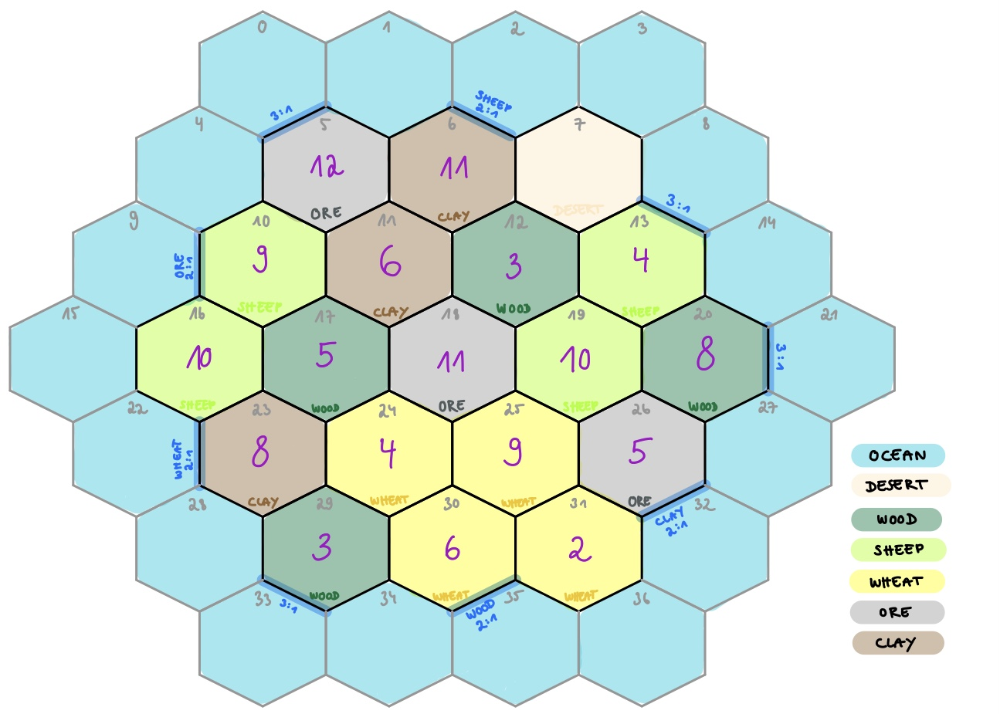
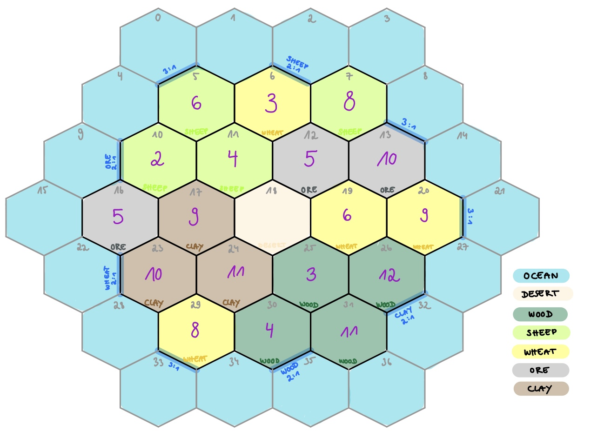
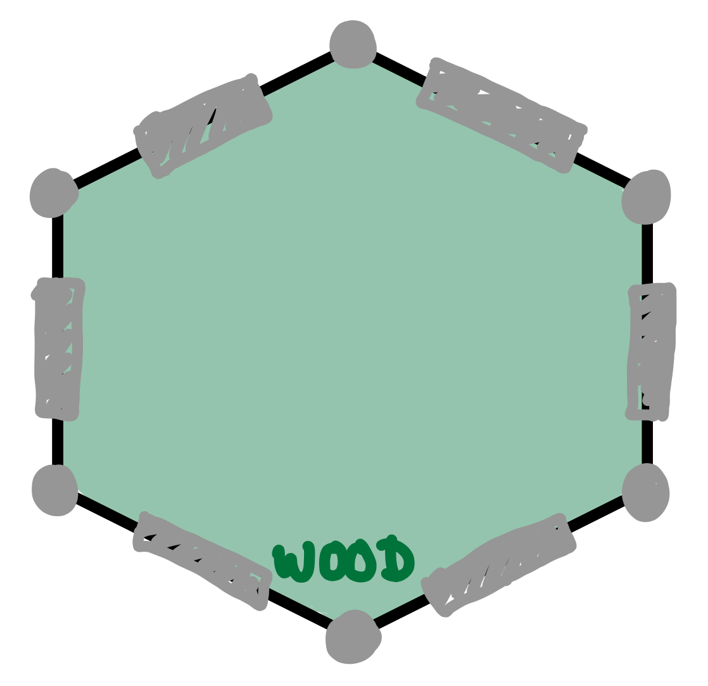
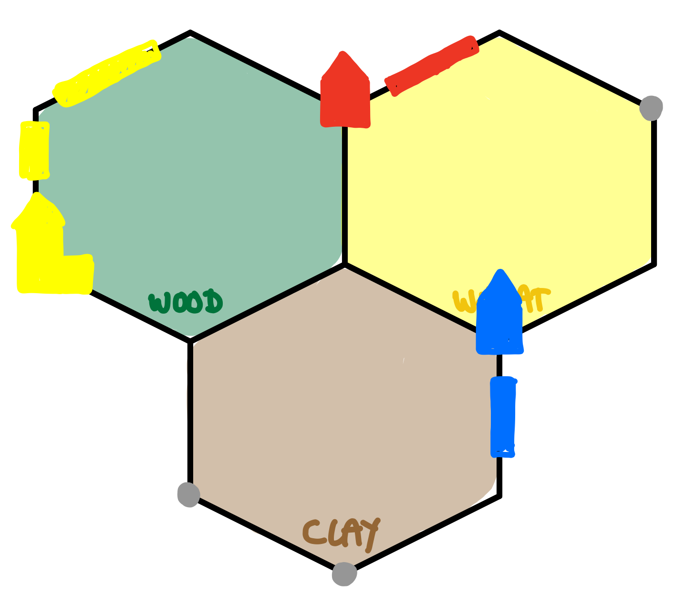
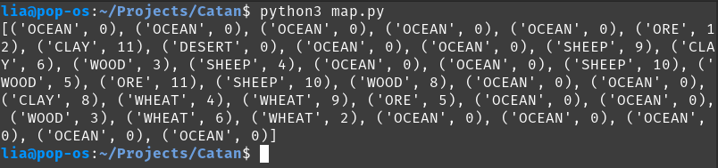
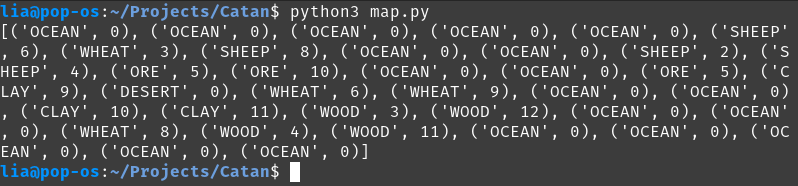

# Settlers of Catan
This project aims to implement a fully autonomous, intelligent agent capable of playing the popular board game Settlers of Catan. The agent uses a heuristic search algorithm called MCTS (Monte-Carlo-Tree-Search) to produce intelligent decisions within the game. Given enough processing time, this bot is supposed to find optimal turns for every given gamestate. It is roughly modeled after DeepMinds AlphaGo.
## Explanation of the game
### Game Components
- 19 terrain hexes (tiles: 4x WOOD, 3x ORE, 4x WHEAT, 4x SHEEP, 3x CLAY, 1x DESERT)
- 18 ocean hexes
- 9 PORTS (4x 3:1-Port, 1x 2:1-Port for each Resource)
- 18 circular number tokens
- 95 ResourceCards (19 of each resource: WOOD, ORE, WHEAT, SHEEP, CLAY)
- 25 DevelopmentCards (14x KNIGHT_CARD, 2x MONOPOLY, 2x DEVELOPMENT, 2x CONSTRUCTION, 5x VICTORY_POINT_CARD)
- 2 SpecialCards: LONGEST_ROAD, LARGEST_ARMY
- 16 CITIES (4 of each color: red, orange, white, blue)
- 20 VILLAGES (5 of each color)
- 60 STREETS (15 of each color)
- 2 Dice
- 1 Bandit
### Board
The game board is laid out randomly. The board changes each game.
Example 1:

Example 2:
 
### Setting up the game
All players choose a color and the one who rolls the highest number gets priority 1. Priority 2 - 4 are distributed clockwise.
Player 1 places his first village and an adjacent street. After that, everyone places clockwise. Player 4 places 2 villages and 2 streets directly, then counterclockwise the remaining players place their village and street.
Everyone takes the appropriate resource cards from stack.
### Distance Rule
- Villages and cities may only be placed at the corners of the terrain hexes, streets at the edges of the terrain hexes:
	-  
- There must be a free space between two buildings:
	-  
### Turn Overview
Player 1 begins.
- **roll for resource production:** sum of the dice determines which terrain hexes produce resources for adjacent buildings (1 resource card per village, 2 ressource cards per city)
- **trade** 
	- with other players
	- 4:1 with the bank: 4 identical resource card back in their stack, take any 1 resource card of your choice
	- 3:1 or 2:1 with ports
- **build** to increase your victory points
	-  **streets** to expand your road network (1x wood, 1x clay)
		-  must always connect to 1 of your existing roads, buildings
	-  **villages** (1x wood, 1x clay, 1x wheat, 1x sheep)
		-  each must connect to at least 1 of your own roads
		-  regardless of whose turn it is, when a terrain hex produces resources, you receive 1 resource card for each village you have adjacent to that terrain hex
		-  *1 Victory Point*
	-  **cities** on top of villages (2x wheat, 3x ore)
		-  upgrades a village, village back to supply
		-  produces 2 resource cards
		-  *2 Victory Points*
	-  place them on the game board, you cannot build more than what is available in your pool (5x village, 4x city, 15x street)
- **buy development card** (1x wheat, 1x sheep, 1x ore) keep them hidden in your hand
- **play development card** at any time during turn
	- dev cards never go back to supply
	- only one dev card per round
	- player cannot play a card he bought during the same round, except for a victory point card
- **pass** dice to player to your left
### Special cases
- **roll a 7**
	- no one receives any resources
	- any player who has more than 7 resource cards must select half and return them to the bank
	- player must move the bandit, to any other terrain hex or desert hex
	- player steals one random resource card from an opponent who has a building adjacent to the terrain hex
- **bandit** prevents that players receive resources on terrain hex
### Victory points
- **Longest Road:** the first player to build a continuos road of at least 5 streets receives the special card. If another player builds a longer road, he immediately takes the special card. *2 Victory Points*
- **Largest Army:** the first player to have 3 knight cards played receives the special card. If another player has more knight cards played, he receives the special card. *2 Vicory Points*
### Ending the game
if one player has 10 or more victory points during your turn, the game ends and he is the winner.

## Implementation in Python
### Class CatanMap
Pepresentation and generation of the board
- **Adjacency**
	- Matrix(36x36): adjacent tiles to represent map
	- *generateAdjacency()* to generate Adjacency
	- *getAdjacency()* returns Adjacency
- **TileList**
	- List (TileType, value)
	- TileTypes: WOOD, CLAY, SHEEP, ORE, WHEAT
	- values: 2 - 12, correspond to the dice roll
	- *generateMap()* to generate TileList randomly
	- *getTileList()* returns TileList
	- Example 1:
		 
	- Example 2:
		
	- *getTilesToValue(value)* returns Numbers of Tiles with value "value"
- **AvailableNodes**
	- List of availableNodes (tile1, tile2, tile3)
	- (tile1, tile2, tile3): numbers of adjacent hex tiles
	- all available positions for buildings
	- *generateNodeList()* to initialize AvailableNodes
	- *getAvailableNodes()* returns AvailableNodes
	- *updateAvailableNodes(position)* input: position of build village -> deletes all surrounding positions in AvailableNodes
- **ObjectList**
	- List of Objects on Map: {playerName, type of Object, position}
	- *initializeObjectList()* to initialize ObjectList with Ports
	- *getObjectList()* returns ObjectList
	- *getPlayerShit(player)* returns all Objects of player
	- *getAvailableStreets(player)* returns all available positions for streets for player
	- *getAvailableVillages(player)* returns all available positions for villages for player
	- *getAvailableCities(player)* returns all available positions for cities for player
	- *getVillagesToTile(tile)* returns all villages adjacent to tile
	- *getCitiesToTile(tile)* returns all cities adjacent to tile
	- *buildStuff(player, type, position, round)* to update ObjectList
- **BanditPosition**
	- *getBanditPosition()* returns BanditPosition
	- *setBanditPosition(position)* updates BanditPosition 
### Class Player
- **Name**
	- string
	- *getName()* returns Name
	- *setName(name)* update Name
- **Priority**
	- int 0 - 3
	- *getPriority()* returns Priority
	- *setPriority(prio)* update Priority
- **VictoryPoints**
	- int 0 - 10
	- *getVictoryPoints()* returns VictoryPoints
	- *updateVictoryPoints(flag)* add(0), deduct(1) point, checks if >= 10
- **AvailableObjects**
	- Dictionary: CITY:4, VILLAGE:5, STREET:15
	- *initializeAvailableObjects()* initializes AvailableObjects
	- *getAvailableObjects()* returns AvailableObjects
	- *updateAvailableObjects(object, flag)* append(1), delete(0) object from dictionary
- **ResourceCards**
	- Dictionary: WHEAT:0, ORE:0, SHEEP:0, WOOD:0, CLAY:0
	- *initializeResourceCards()* initializes ResourceCards
	- *getResourceCards()* returns ResourceCards
	- *updateResourceCards(card, flag)* append(1), delete(0) card from dictionary
	- *check7()* if player owns more than 7 cards, discards half of the cards
	- *getRandomResourceCard()* returns random ResourceCard
	- *trade(x, card1, card2)* trades x of card1 to one of card2
	- *trade4(card1, card2)* trades 4 of card1 to one of card2
- **DevelopmentCards**
	- empty List
	- *getDevelopmentCards()* returns DevelopmentCards
	- *updateDevelopmentCards(card, round, flag)* append(1), delete(0) card, checks if card exists and if bought in different round
	- *chooseDevCard()* prints DevelopmentCards and expects input, returns chosen DevelopmentCard
### Class Gamestate
- **DevelopmentCards**
	- Dictionary: KNIGHT_CARD:14, VICTORY_POINT_CARD:5, MONOPOLY:2, DEVELOPMENT:2, CONSTRUCTION:2
	- *initializeDevelopmentCards()* initializes DevCards
	- *getDevelopmentCards()* returns DevelopmentCards
	- *updateDevelopmentCards(card)* removes card from stack
	- *getRandomDevCard()* returns random DevCard from stack
	- *KNIGHTCARD(playerName)* player plays KNIGHT_CARD, moves Bandit
	- *VICTORYPOINTCARD(playerName)* player plays VICTORY_POINT_CARD, increments Victory Points
	- *CONSTRUCTION(playerName)* player plays CONSTRUCTION, builds 2 streets
	- *MONOPOLY(playerName, resourceCard)* player plays MONOPOLY, opponents give all cards of the selected type to the player
	- *DEVELOPMENT(playerName)* player chooses 2 ResourceCards 
- **CountDevCards**
	- Number of DeveloopmentCards in stack
	- *getCountDev()* return CountDevCards
	- *decCountDev()* CountDevCards --
- **ResourceCards**
	- Dictionary: WHEAT:19, ORE:19, SHEEP:19, WOOD:19, CLAY:19
	- *initializeResourceCards()* initializes ResourceCards
	- *updateResourceCards(card, flag)* adds(1), removes(0) ResourceCard from stack
- **Map** CatanMap Object
- **Player 1 - 4** Player Objects
	- 3 or 4 players
	- *getPlayerToName(name)* returns Player Object to name
- **PlayerList**
	- *initializePlayerList(player)* initializes PlayerList
	- *getPlayerList()* returns PlayerList
- **CurrentPlayer** <-
- **Round**
	- current Round
	- *getRound()* returns Round
	- *incRound()* Round ++
- **Trading functions**
	- ...
### Class Simulation
- **gamestate** Gamestate Object
	- *getRound()* returns gamestate.Round
	- *incRound()* increments gamestate.Round
- **Functions to Interacts with CatanMap**
	- *getObjectList()* returns ObjectList
	- *getAvailableStreetPositions(playerName)* returns List of AvailableStreetPositions of player
	- *getAvailableVillagePositions(playerName)* returns List of AvailableVillagePositions of player
	- *getAvailableCityPositions(playerName)* returns List of AvailableCityPositions of player
	- *buildObject(playerName, type, position)* updates Map, removes ResourceCards from player
	- *bandit(position)* updates BanditPosition
- **Functions to Interact with Player**
	- *priorityRoll(player)* initializes Priorities
	- *giveResourceCard(playerName, card, count)* adds countx card 
	- *removeResourceCard(playerName, card, count)* removes countx card
	- *handOutCards(roll)* cards are dealt depending on the dice roll
	- *drawDevelopmentCard(playerName)* player draws random DevelopmentCard, removes ResourceCards
	- *playDevelopmentCard(playerName, devCard)* player plays devCard
	- *getPlayerToName(playerName)* returns PlayerObject to name
